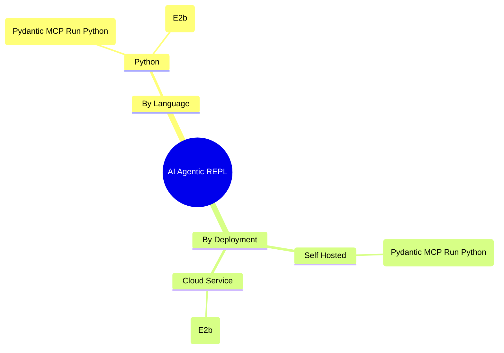

# AI-Agentic-REPL
Description and Utilization of Read Eval Print Loop (REPL) aka known as Code Sandboxes for Agentic Usecases

# Technology Map Agentic REPL

## Listview

| Project | Link | In this Repo |
| --------| -----| ------------ | 
| Pydantic MCP Run Python | https://ai.pydantic.dev/mcp/run-python/ | .. |
| E2b | https://e2b.dev/docs/quickstart |  |
