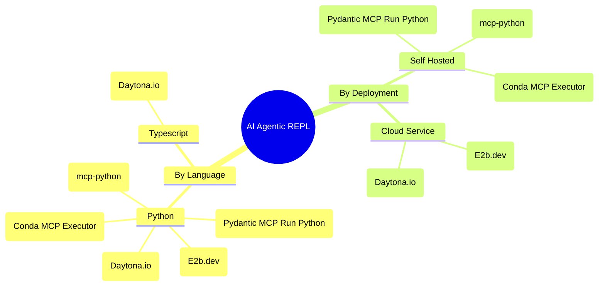

# AI-Agentic-REPL
Description and Utilization of Read Eval Print Loop (REPL) aka known as Code Sandboxes for Agentic Usecases

# Technology Map Agentic REPL

## Listview

| Project | Link | In this Repo |
| --------| -----| ------------ | 
| Pydantic MCP Run Python | https://ai.pydantic.dev/mcp/run-python/ | [pydantic-mcp-python-run](python/pydantic-mcp-python-run/) |
| E2b.dev | https://e2b.dev/docs/quickstart |  |
| Daytona.io | https://www.daytona.io/ |  |
| mcp-python | https://github.com/hdresearch/mcp-python ||
| Conda MCP Executor | https://github.com/bazinga012/mcp_code_executor ||
